 

  <h1>👋 Hello! I'm David Hospinal</h1>

  
<i>Master in IT & Management | AI Projects Consultant & Project Manager | Innovation Driver</i>

  
  
  
  
  
  
  
  

---

## 🎥 Professional Introduction

### Watch My Professional Profile Video

<table>
<tr>
<td width="40%" align="center">
  
    
  
</td>
<td width="60%" align="left">
  <h3>🎓 Academic Background</h3>
  <ul>
    <li><b>Master in Information Technology & Management</b> Pontificia Universidad Católica de Chile</li>
    <li><b>Diplomatura in Computational Science</b> Universidad Nacional de Ingeniería (Jan 2025 - Sept 2025) <i>Comprehensive training: ODOO ERP (functional/technical), Scrum & PMI Level I-II, MS Project & Primavera P6, ISO 27001, Oracle fundamentals. Combining agile methodologies, PMI/PMBOK standards, and enterprise systems.</i></li>
    <li><b>Living and Studying Internationally (CEFR ENG B1/B2)</b> Eberhard Karls Universität Tübingen, Germany (Jan 2024 - May 2024) <i>Tübingen Virtual Intercultural Program (TÜ-VIP): Enhanced intercultural and global competencies through collaborative projects, developing adaptability and leadership in multicultural technological settings.</i></li>
    <li><b>Systems Engineer</b> Universidad Peruana de Ciencias Aplicadas (UPC)</li>
  </ul>

  <h3>💼 Professional Expertise</h3>
  <ul>
    <li>🎯 <b>AI Project Management & Consulting</b> - Strategic planning and delivery of AI solutions</li>
    <li>🤖 <b>Artificial Intelligence & Machine Learning</b></li>
    <li>📊 <b>Data Science & Analytics</b></li>
    <li>🔄 <b>Digital Transformation Leadership</b></li>
    <li>📦 <b>Supply Chain Optimization</b> with SAP ERP</li>
    <li>🗣️ <b>BERT Models</b> for Dialogue State Tracking (DST)</li>
    <li>👁️ <b>Computer Vision</b> for Image Recognition</li>
    <li>💡 <b>AI Consulting</b> in Banking, Construction & Telecommunications</li>
  </ul>

  
<i>📠Open to collaborate on AI, Data Science, and Computer Vision projects!</i>

</td>
</tr>
</table>

---

## 🚀 About Me

Professional with **10+ years of experience** across diverse industries including hospitality, hydrocarbons, telecommunications, construction, banking, food, retail, and more. I've held various strategic positions thanks to my comprehensive vision of production processes and ability to anticipate customer needs through innovation.

### 💡 What I Bring to the Table

- **🎯 Strategic Management**: Valuable managerial and administrative experience across major economic sectors nationally and internationally
- **📊 Data-Driven Decision Making**: Process optimization through Data Science and Artificial Intelligence applications
- **🔄 Comprehensive Operations**: Management of new openings, cost control, KPI development, supply logistics, recruitment, and team training
- **💻 Tech Integration**: Expertise in ERP, CRM, and SCM systems for informed decision-making
- **🌟 Innovation Focus**: Combining IT management with Data Science and AI to drive impactful professional results

### 🎓 Research & Publications

Check out my scientific articles and research contributions:
- 📚 [ORCID Profile](https://orcid.org/0000-0002-5298-6268) - Published research and academic contributions

### 📄 Professional Documents

- 💼 [Interactive CV/Portfolio](https://portfolio-cv-oscardavid-hospinal.vercel.app/) - Comprehensive resume and project showcase

---

## 🎬 Featured Projects & Video Tutorials

### 🌟 Interactive Project Showcase

*Hover over the projects to explore my work in AI, Cybersecurity, Ethics, and Environmental Tech*

<!-- Row 1: Projects -->
<table>
<tr>
<td width="50%" align="center">
  

    <h3>🔬 JT Fluorescence Microscopy</h3>
    
    

      
      
    

    
<i>Advanced fluorescence microscopy denoising methods using cutting-edge image processing techniques</i>

  

</td>

<td width="50%" align="center">
  

    <h3>🛡️ RustSIEM CyberSecurity</h3>
    
    

      
      
    

    
<i>High-performance Security Information and Event Management system built with Rust</i>

  

</td>
</tr>

<!-- Row 2: Projects -->
<tr>
<td width="50%" align="center">
  

    <h3>🤖 PERI Ethics App</h3>
    
    

      
      
    

    
<i>Comprehensive AI Ethics assessment and analysis platform built with Next.js</i>

  

</td>

<td width="50%" align="center">
  

    <h3>🌊 MPREAC Ocean App</h3>
    
    

      
      
    

    
<i>Marine pollution and environmental research analysis application for ocean conservation</i>

  

</td>
</tr>
</table>

### 📺 More Content

---

## 🛠️ Tech Stack & Skills

### Languages & Frameworks

### Data Science & AI

### Cloud & DevOps

### Business Systems & Tools

---

## 📊 GitHub Analytics

  
  

  

---

## 🎯 Industry Experience

### 10+ Years Across Multiple Industries

```mermaid
%%{init: {'theme':'dark', 'themeVariables': { 'primaryColor':'#1e90ff','primaryTextColor':'#fff','primaryBorderColor':'#00d4ff','lineColor':'#00d4ff','secondaryColor':'#ff6b6b','tertiaryColor':'#4ecdc4','noteTextColor':'#fff','noteBkgColor':'#1e3a8a'}}}%%
graph TB
    A[<b>David Hospinal</b><br/>10+ Years Experience]

    A -->|Strategic| B[🏨 Hospitality]
    A -->|Technical| C[💻 Tech & Telecom]
    A -->|Financial| D[🏦 Banking & Finance]
    A -->|Industrial| E[⚡ Energy & Hydrocarbons]
    A -->|Management| F[🏗️ Construction & Retail]
    A -->|Innovation| G[🤖 Data Science & AI]

    B --> B1[Operations Management]
    B --> B2[Customer Experience]
    B --> B3[Quality Control]

    C --> C1[IT Systems Integration]
    C --> C2[Digital Transformation]
    C --> C3[SAP ERP Implementation]

    D --> D1[Process Optimization]
    D --> D2[Risk Analysis]
    D --> D3[AI Consulting]

    E --> E1[Supply Chain Optimization]
    E --> E2[Logistics Management]
    E --> E3[Data Analytics]

    F --> F1[Project Management]
    F --> F2[KPI Development]
    F --> F3[Team Leadership]

    G --> G1[Machine Learning Models]
    G --> G2[Computer Vision]
    G --> G3[NLP & BERT Models]
    G --> G4[Predictive Analytics]

    style A fill:#1e3a8a,stroke:#00d4ff,stroke-width:4px,color:#fff
    style B fill:#2563eb,stroke:#60a5fa,stroke-width:2px,color:#fff
    style C fill:#2563eb,stroke:#60a5fa,stroke-width:2px,color:#fff
    style D fill:#2563eb,stroke:#60a5fa,stroke-width:2px,color:#fff
    style E fill:#2563eb,stroke:#60a5fa,stroke-width:2px,color:#fff
    style F fill:#2563eb,stroke:#60a5fa,stroke-width:2px,color:#fff
    style G fill:#7c3aed,stroke:#a78bfa,stroke-width:3px,color:#fff
```

---

## 🎓 Deep Learning Experience: Universidad de Buenos Aires

### 🇨🇱 ➡️ 🇦🇷 1st Spring School in Deep Learning at UBA

<table>
<tr>
<td width="45%" align="center">
  
    
  
</td>
<td width="55%" align="left">
  <h3>✈️ International Deep Learning Journey</h3>

  
<b>Event:</b> 1st Spring School in Deep Learning 
  <b>Location:</b> Universidad de Buenos Aires (UBA), Argentina 
  <b>Date:</b> October 20-24, 2025 
  <b>Distance:</b> 1,139 km from Santiago, Chile to Buenos Aires

  <h4>🌟 Highlights</h4>
  <ul>
    <li>🌠<b>International Networking</b> with professionals from 15+ countries: 
    <i>Argentina, Chile, Brazil, Colombia, Ecuador, Uruguay, Paraguay, Peru, Mexico, Cuba, Costa Rica, France, Spain, Guatemala, Venezuela</i></li>
    <li>📚 <b>Intensive Learning</b> on latest Deep Learning trends and techniques</li>
    <li>🏛️ <b>Knowledge Exchange</b> at one of Latin America's most prestigious institutions</li>
    <li>💡 <b>New Perspectives</b> on AI applications across diverse sectors</li>
  </ul>

  <h4>🙏 Special Thanks to Organizers</h4>
  
<i>Enzo Ferrante, Marcelo Pereyra, Nicolás Gaggion</i>

  <h4>🏢 Supporting Organizations</h4>
  
<i>International Centre for Mathematical Sciences • CNRS • Heriot-Watt University • Apple • Inria Chile • ICC-UBA-CONICET • Facultad de Ciencias Exactas y Naturales UBA • Departamento de Computación Exactas-UBA • Laboratorio de Inteligencia Artificial Aplicada</i>

  
💡 <b>Key Takeaway:</b> The importance of stepping out of our comfort zone and connecting with communities that share our passion for technology and innovation.

</td>
</tr>
</table>

---

## 🤝 Let's Connect!

I'm always looking for new challenges and opportunities to apply my knowledge and skills in projects that make a difference.

**Interested in collaborating on:**
- 🤖 Artificial Intelligence & Machine Learning projects
- 📊 Data Science & Analytics initiatives
- 💼 IT Management & Digital Transformation
- 🔬 Research & Innovation
- 👁️ Computer Vision applications
- 🗣️ Natural Language Processing (NLP)

### 📫 Get in Touch

---

  

    

  <i>⭐ From [DavidHospinal](https://github.com/DavidHospinal) with passion for innovation and technology ⭐</i>

   

  

  

